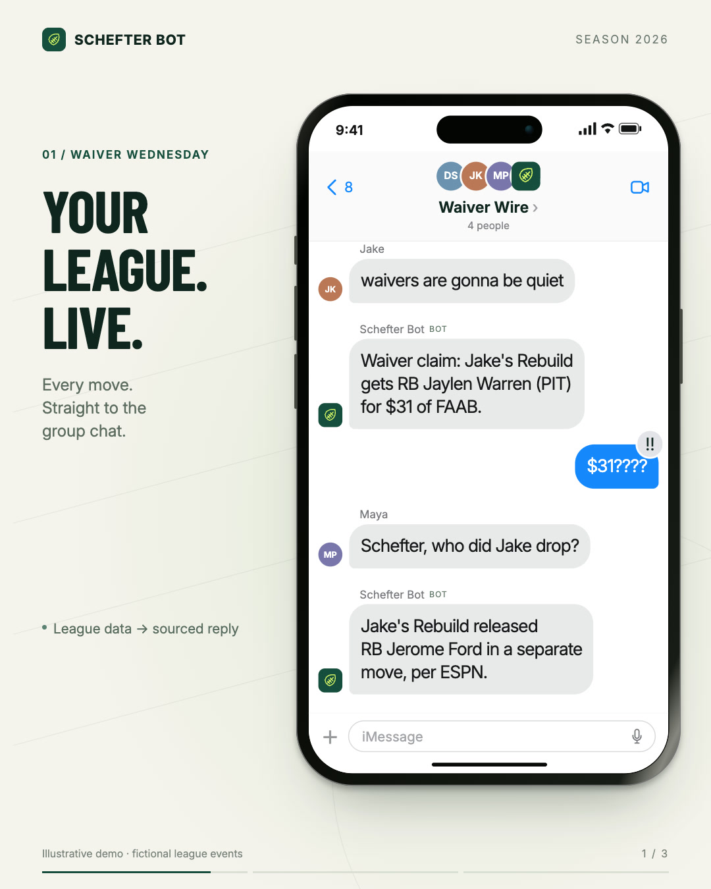

# Schefter Bot

Your fantasy league's group chat has a news desk.

Schefter Bot watches an ESPN Fantasy Football league and reports adds, drops,
waiver claims and trades into an iMessage group chat in a concise sports-news style.

It can also answer mention-gated questions inside that group through a local
BlueBubbles webhook: `Schefter, what were the latest moves?`

[](https://github.com/drewdouglas0-bit/schefter-bot-public/releases/download/v1.0.0/schefter-bot-linkedin.mp4)

[Watch / download the 54-second demo](https://github.com/drewdouglas0-bit/schefter-bot-public/releases/tag/v1.0.0)
· [Rebuild the video](promo-video/README.md) · [Setup guide](SETUP.md)

The demo uses fictional league events and scripted conversations. Automated alert
and recap copy comes from the real Python formatters; conversational replies are
illustrative, not a recording of a live model session.

Independent project. Not affiliated with or endorsed by Adam Schefter, ESPN,
Apple, or the NFL.

## What it posts

| Feature | When | What |
|---|---|---|
| **Transactions** | every poll | adds, drops, waiver claims, trades |
| **Injuries** | every poll | a rostered player's status changes to OUT / IR / doubtful |
| **Inactives** | Sunday 11am–1pm ET | starters who are OUT or on a bye — before kickoff |
| **Recap** | Tuesday 9am–12pm ET | scores, high/low, closest game, bench blunders |
| **Power rankings** | Tuesday 9am–12pm ET | rankings with week-over-week movement |

Each is toggled independently in `.env`. Defaults are tuned for signal —
roughly 3–8 messages in a normal week. The failure mode for a bot like this
isn't too few features, it's the league muting the chat.

## How it works

1. `schefter/espn.py` talks to ESPN via `espn-api`.
2. `schefter/features/` — one module per feature, each deciding when it should
   fire and what to say.
3. `schefter/state.py` dedupes: transaction fingerprints, last-announced injury
   status, and which week each scheduled feature last ran for.
4. `schefter/formatter.py` and `schefter/voice.py` supply the compact NFL-news voice.
5. `schefter/imessage.py` sends through Messages.app via AppleScript.
6. `launchd` runs a poll every 5 minutes.

For interactive replies, BlueBubbles delivers incoming messages to
`schefter/listener.py`; `schefter/agent.py` answers with OpenAI using read-only
ESPN tools and optional live web search. It ignores every chat except the
configured league group. Address it with `Schefter` or `@Schefter`, at the start,
middle, or end of a request; merely talking about the bot does not trigger it.
It can also run plain-text group polls ("Schefter, set a poll for PPR, half PPR,
or no PPR"): the poll posts as a numbered list, bare replies are counted
silently, and the bot reports the tally on request. See [SETUP.md](SETUP.md).

Before any tool-enabled answer, the model is instructed to stay within football,
this league, and its members, and to decline photo/image requests and slurs
immediately without using a tool. `schefter/guardrails.py` backs that up with a
deterministic, pre-API check for prompt-injection/secret-exfiltration attempts
and a consent gate on trade-creating tools. `schefter/moderation.py` also blocks
known slurs locally, before the model is ever called.

## Setup

Requires macOS, Python 3.10+, an ESPN league, and a Messages account. Interactive
replies additionally require BlueBubbles Server and an OpenAI API key with access
to your configured model. API usage can incur charges. The scheduled alerts do
not require an OpenAI API key.

Follow [SETUP.md](SETUP.md) for the complete install. Use your own credentials:

```bash
cp .env.example .env      # then fill it in
```

**League ID** — open your league on fantasy.espn.com; it's the `leagueId` in the URL.

**Cookies (private leagues only)** — on fantasy.espn.com open DevTools →
Application → Cookies → `https://fantasy.espn.com`, and copy `espn_s2` and `SWID`
(keep SWID's curly braces). If the bot starts throwing auth errors, refresh the
cookies; their lifetime can vary.

**Chat ID** — `./venv/bin/python -m schefter.chats` lists your group chats.

**Interactive agent** — see [SETUP.md](SETUP.md#6-enable-interactive-group-chat-replies)
for BlueBubbles, webhook, and API-key setup.

## Commands

```bash
./venv/bin/python -m schefter.doctor             # check every prerequisite
./venv/bin/python -m schefter.chats              # list group chats + GUIDs
./venv/bin/python -m schefter.main               # normal poll
./venv/bin/python -m schefter.main --dry-run     # preview; never sends, never writes state
./venv/bin/python -m schefter.main --replay 10   # print last 10 transactions
./venv/bin/python -m schefter.main --reseed      # mark all current activity as seen
./venv/bin/python -m schefter.listener           # run interactive listener in foreground

# Preview a scheduled feature outside its window:
./venv/bin/python -m schefter.main --only recap --force
./venv/bin/python -m schefter.main --only inactives --force
```

`--force` skips the schedule windows and **previews by default**, since forcing
a weekly message twice would double-post it. Add `--send` if you actually mean
to fire it — e.g. the Mac was asleep through Tuesday's recap window.

`--dry-run` never writes state, so previewing the injury feed can't swallow an
alert that hasn't been sent yet.

First run auto-seeds: it records existing history and sends nothing, so you don't
dump the last 25 transactions into the chat.

If a single poll turns up more than `MAX_PER_POLL` (default 6) new activities —
post-draft churn, a big waiver run — the bot posts one digest instead of firing
six-plus separate messages into the chat.

## Scheduling

```bash
./install.sh  # after filling in .env and running the prerequisite checks
```

The installer creates `com.schefterbot.agent` (five-minute polling) and, when
enabled, `com.schefterbot.listener`. To stop the default instance:

```bash
launchctl unload ~/Library/LaunchAgents/com.schefterbot.agent.plist
launchctl unload ~/Library/LaunchAgents/com.schefterbot.listener.plist
```

For multiple league installs, use `INSTANCE=my-league ./install.sh`; that name
is included in the launch-agent labels. Logs remain local and are gitignored.

## Requirements

- The Mac stays awake and logged in, with Messages.app running. A sleeping laptop
  posts nothing (it catches up on wake).
- Terminal needs Automation → Messages permission (System Settings → Privacy &
  Security → Automation).

## Tuning the voice

The researched voice rules live in [VOICE.md](VOICE.md). Transaction templates
live in `schefter/formatter.py` — `FA_LEDES`, `WAIVER_LEDES`, `DROP_ONLY_LEDES`,
`SOURCING`. Add lines to any list and they enter the rotation. `schefter/voice.py`
applies final cleanup (strips common assistant tells, em dashes) to every
outgoing message, model-generated and scheduled alike.

## Privacy and development

Never commit `.env`, ESPN session cookies, webhook secrets, chat identifiers,
phone-number mappings, message history, state databases, or logs. Only the empty
`.env.example` template is included. Tell group members what the bot stores and
what is sent to external providers before enabling it; see [SECURITY.md](SECURITY.md).

This public repository begins with a sanitized source snapshot. It does not
include private deployment history or real group-chat transcripts.

```bash
python3 -m venv venv
./venv/bin/pip install -r requirements.txt
./venv/bin/python -m unittest discover -s tests
```

The tests use fixtures and mocked external services; they do not send iMessages
or require live ESPN/OpenAI credentials. One listener test binds to localhost.

## License

Original project code is MIT licensed. Bundled fonts and dependencies retain
their own licenses; see [THIRD_PARTY_NOTICES.md](THIRD_PARTY_NOTICES.md).
